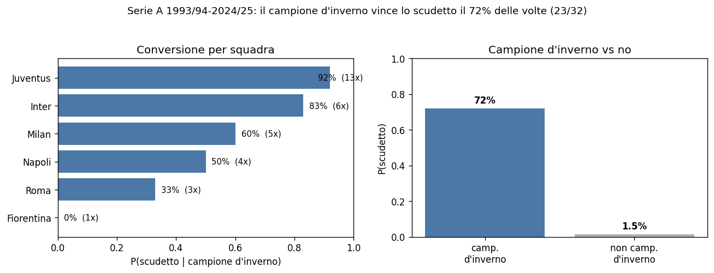

# statsXSerieA

Due domande, sui dati veri della Serie A:

1. Qual è la probabilità che il campione d'inverno vinca lo scudetto? Il calcolo è fatto all'inverno, cioè a fine girone di andata.
2. E l'Inter, da campione d'inverno, che probabilità ha?

Nasce da una provocazione tra colleghi: uno senior, uno che sta diventando data scientist. Da una domanda nascono domande.

## Com'è fatto

Dati e analisi sono separati. I dati passano per un piccolo magazzino in stile **medallion** (raw -> bronze -> silver); il notebook fa solo l'analisi e legge l'ultimo strato.

```
                football-data.co.uk
                        |
                        v   ingestion.py
            +------------------------+
            |  data/raw/             |   CSV grezzi, come scaricati
            +------------------------+
                        |
                        v   bronze.py      (schema fatto rispettare)
            +------------------------+
            |  data/bronze/          |   CSV validi e leggibili
            +------------------------+
                        |
                        v   silver.py      (solo colonne utili)
            +------------------------+
            |  data/silver/          |   l'input dell'analisi
            +------------------------+
                        |
                        v
            analisi/probScudetto...ipynb   (le due domande)
```

- **raw**: quello che arriva da football-data.co.uk, intatto.
- **bronze**: stessi dati resi leggibili. Alcune stagioni (2003/04, 2004/05) hanno un numero variabile di colonne vuote in coda e pandas non le parsa. Qui si tiene solo lo schema dichiarato dall'intestazione e si scartano le colonne vuote. Una volta sola, non a ogni lettura.
- **silver**: solo le colonne che servono all'analisi (Date, HomeTeam, AwayTeam, FTHG, FTAG), una stagione per file.

## Struttura

```
statsXSerieA/
├── pipeline/        gli script dati
│   ├── config.py
│   ├── ingestion.py
│   ├── bronze.py
│   ├── silver.py
│   └── run_pipeline.py
├── data/
│   ├── raw/
│   ├── bronze/
│   └── silver/
├── analisi/
│   └── probScudettoSeCampioneInverno.ipynb
├── environment.yml
├── requirements.txt
└── README.md
```

## Ambiente

Con conda:

```
conda env create -f environment.yml
conda activate statsxseriea
```

Oppure con pip:

```
pip install -r requirements.txt
```

## Come si usa

I dati sono già nel repo, quindi puoi aprire direttamente il notebook e fare Run All:

```
jupyter notebook analisi/probScudettoSeCampioneInverno.ipynb
```

Per rigenerare o aggiornare il magazzino dati (scarica e prepara tutto):

```
python -m pipeline.run_pipeline
```

## Il risultato

Dal 1993/94 al 2024/25 (32 stagioni) il campione d'inverno vince poi lo scudetto
**23 volte su 32, circa il 72%** (intervallo di Wilson 95%: 0.55–0.84).



La media però nasconde molto:
- per squadra la conversione va da Juventus 12/13 (92%) a Fiorentina 0/1, con Inter 83%, Milan 60%, Napoli 50%, Roma 33%;
- 9 volte lo scudetto è andato a chi non era campione d'inverno (Juventus 4, Milan 3, Inter 1, Lazio 1);
- confronto netto: P(scudetto | campione d'inverno) = 72% contro P(scudetto | non) = 1.5% (Fisher esatto, p ≈ 1.7e-27);
- nella logistica letta sui parametri, a metà stagione conta il distacco sul secondo (odds ×1.5 per punto), non la differenza reti.

32 stagioni restano poche: è una tendenza forte, non una legge. Dettagli, tavole e test nel notebook.

## Cosa è cambiato rispetto all'originale

- Dati e analisi separati: pipeline negli script, analisi nel notebook.
- Introdotto il magazzino medallion (raw/bronze/silver).
- La pulizia delle stagioni "rotte" non è più un cerotto a ogni lettura: si fa una volta, in bronze, facendo rispettare lo schema.
- Tolti i percorsi assoluti: tutto relativo al repo.
- Analisi ampliata: parte esplorativa, tavola di contingenza (con test) e lettura statistica della logistica (statsmodels).
- Codice rivisto: classifica vettorializzata (niente `iterrows`), niente duplicazioni, snake_case/PEP8, `random_state` fissato. Risultati invariati.
- Aggiunti README, requirements.txt, environment.yml.

## Crediti

- Dati: football-data.co.uk
- Idea e analisi originale: il collega (questo repo è un fork).
