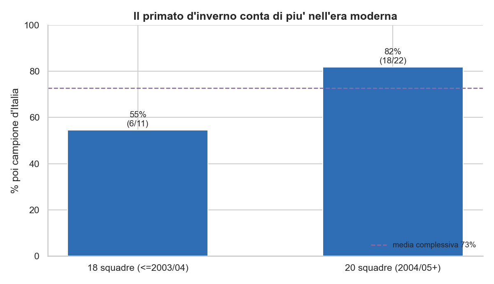
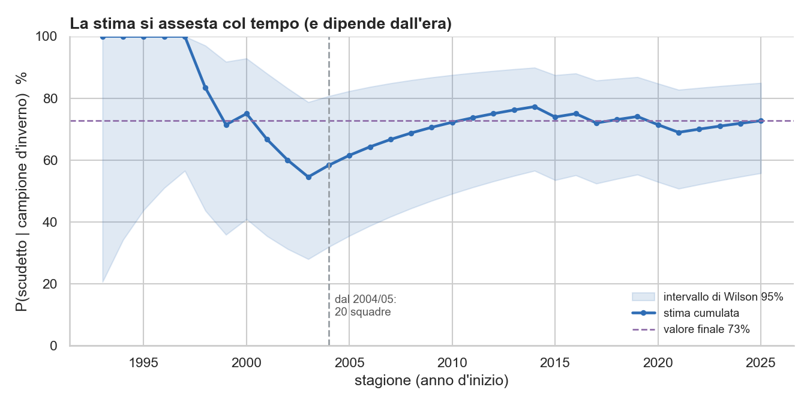
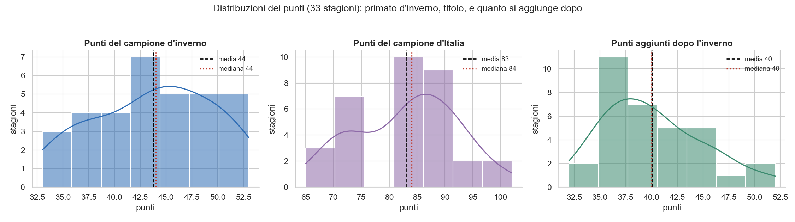

# Quello che l'inverno sa dello scudetto
### Parte 1 — La domanda

*Da trent'anni il campione d'inverno della Serie A diventa campione d'Italia quasi tre volte su quattro. È un presagio, o solo il riflesso di un vantaggio difficile da buttare via?*

C'è un titolo, in Serie A, che non esiste. Non si alza al cielo, non finisce in bacheca, non vale un punto. Eppure ogni gennaio viene assegnato con una certa solennità: *campione d'inverno*, la squadra prima in classifica alla fine del girone di andata. È una di quelle etichette che il calcio si porta dietro per abitudine e scaramanzia, sospesa tra la statistica e il presagio. La domanda vera, sotto, è sempre la stessa: conta qualcosa, o è solo un modo per riempire le pagine di metà stagione?

La cosa è nata, come spesso capita, da una provocazione tra colleghi. Uno con un po' di strada da data scientist alle spalle la lancia a uno più giovane, che quella strada la sta appena imboccando: «Hai voglia? Qual è la probabilità che una squadra di Serie A vinca lo scudetto, dato che è campione d'inverno?». Sembra una domanda da bar. È invece l'inizio perfetto, perché — come succede coi dati — da una domanda ne nascono altre.

L'ipotesi da verificare è quella popolare: *campione d'inverno uguale campione d'Italia*. Vediamo se i numeri le danno ragione.

## La risposta, prima di tutto

Per rispondere basta guardare indietro. Dal 1993/94 a oggi, trentatré stagioni, il campione d'inverno ha poi alzato lo scudetto **ventiquattro volte su trentatré**: il **73%** (intervallo di Wilson al 95%: 56–85% — con appena trentatré stagioni anche questo numero ha il suo margine d'errore). Quasi tre volte su quattro. Già così sembra molto, ma un numero da solo non dice quanto pesa: serve un termine di paragone.

Eccolo. In una stagione qualsiasi, una squadra che *non* è campione d'inverno ha una probabilità di vincere lo scudetto dell'1,5%. Una che lo è, del 73%. Essere primi al giro di boa moltiplica le possibilità di titolo per oltre cento volte. Non è un presagio vago: è uno dei divari più netti del calcio italiano.

## La media che nasconde tutto

Il 73%, però, è una media, e le medie sono bugiarde gentili. Spacchettata per squadra, la conversione racconta storie diverse. La Juventus, campione d'inverno tredici volte, ha poi vinto in dodici: il 92%, una quasi-certezza. L'Inter converte cinque-sei volte su sette, il Milan tre su cinque, il Napoli la metà delle volte, la Roma una su tre. La Fiorentina, l'unica volta che ha guidato a metà strada, è finita a mani vuote.

E poi ci sono le rimonte, che sono il sale della faccenda: nove volte in trentatré anni lo scudetto è andato a chi a metà stagione inseguiva. Quattro di queste portano la firma della Juventus, tre del Milan, una a testa di Inter e Lazio. E visto dal lato di chi guidava: a farsi rimontare, almeno una volta, sono finite **tutte e sei** le squadre arrivate prime a metà strada — più spesso Roma, Milan e Napoli, due volte ciascuna. Il vantaggio dell'inverno è reale, ma non è un salvacondotto.

## E l'epoca conta

C'è un taglio che cambia la storia: il numero di squadre. Nell'era a diciotto squadre (fino al 2003/04) il campione d'inverno ha poi vinto appena il 55% delle volte — sei su undici, poco più di un testa o croce. Nell'era a venti squadre (dal 2004/05) si sale all'82%, diciotto su ventidue: quattro volte su cinque. Con così pochi casi, però, gli intervalli sono larghissimi e in parte si sovrappongono (Wilson 95%: 28–79% la prima era, 61–93% la seconda): la differenza è netta come tendenza, fragile come numero.

La media storica della [Lega Serie A](https://www.legaseriea.it/serie-a/news/inter-col-lecce-per-diventare-campione-d-inverno), su tutti i 93 campionati a girone unico, è del 67,7%: il nostro 73% recente sta sopra, e la spaccatura tra le due ere spiega perché. Anche le testate, guardando solo gli ultimi anni, parlano di circa il [79%](https://www.sportmediaset.mediaset.it/calcio/inter/inter-campione-inverno-statistica-scudetto_107743377-202602k.shtml), in linea col nostro 82%. Il "campione d'inverno" non è una costante del calcio italiano — è un indicatore che nella Serie A moderna pesa molto di più. Quale finestra di dati si guarda, insomma, cambia la risposta.

Lo si vede bene seguendo la stima mentre si accumulano le stagioni. All'inizio degli anni Novanta il campione d'inverno vinceva sempre, e la percentuale partiva incollata al 100% — ma su pochissimi casi, con una banda d'incertezza che copriva mezza tabella. Poi la lunga era a diciotto squadre l'ha trascinata giù, fino al 55% dei primi anni Duemila; e solo con l'era moderna la curva è risalita e si è assestata intorno al 73%, mentre la banda si stringeva. È questo il senso del "taglio" degli anni: a seconda di quando si comincia a contare, la stessa domanda dà risposte diverse — e un'unica media le nasconde tutte.

## Quanto è forte un campione d'inverno

Un dettaglio che vale la pena guardare. Un campione d'inverno chiude l'andata con 44 punti: e qui media e mediana coincidono (43,8 e 44), segno di una distribuzione senza code strane — i primati d'inverno si somigliano tutti. A fine stagione il campione d'Italia arriva in media a 83 punti, mediana 84: di nuovo due numeri quasi gemelli. Per dare un metro umano a quella cifra, Massimiliano Allegri — che di conti se ne intende — in conferenza fissa di solito la quota-scudetto un filo più in alto, intorno agli 86-88 punti ([Corriere dello Sport](https://www.corrieredellosport.it/news/calcio/serie-a/milan/2026/01/07-145696785/il_calcolo_preciso_di_allegri_su_scudetto_e_champions_ecco_quanti_punti_servono)): perché a vincere serve di norma qualcosa in più della media, e perché nell'era a venti squadre i totali si sono alzati.

C'è poi un terzo numero, che racconta la seconda metà di stagione: dall'inverno al traguardo il futuro campione aggiunge in media una quarantina di punti (mediana 40), più o meno quanti ne aveva al giro di boa. Il campionato, in fondo, si vince due volte — una prima dell'inverno e una dopo. E se a metà strada il primo viaggia a 2,34 punti a partita, contro i 2,26 con cui in media si solleva il trofeo, è perché la testa all'inverno è il meglio del primo tempo; la maratona, poi, è un'altra storia, e qualcuno rallenta.

Gli indici di dispersione (il dettaglio numerico in appendice) confermano l'impressione: distribuzioni quasi simmetriche — asimmetria vicina a zero, come dicono media e mediana gemelle — e poco disperse, con un coefficiente di variazione attorno al 12%. Ma *piatte*: la curtosi negativa segnala che non c'è un valore "tipico", i punti si spalmano su una fascia ampia. L'unica eccezione è il delta del secondo tempo, leggermente sbilanciato a destra — ogni tanto un campione, dopo l'inverno, mette il turbo.

## La domanda che resta

Torniamo all'ipotesi di partenza — *campione d'inverno uguale campione d'Italia*. I dati le danno ragione, ma a modo loro: vera come tendenza (quasi tre volte su quattro, quattro su cinque nell'era recente), falsa come uguaglianza secca. La Juventus converte nel 92% dei casi, la Roma in una su tre; e nove volte, in trentatré anni, qualcuno ha ribaltato il pronostico. Non tutti i primati di metà stagione, evidentemente, valgono uguale.

Allora la domanda si sposta. C'è qualcosa, già a gennaio, che distingue il campione d'inverno destinato a vincere da quello che verrà raggiunto? La forza con cui domina? L'ampiezza del vantaggio? Il modo in cui ci è arrivato? Per rispondere non basta più contare: serve un modello. Ed è la storia della seconda parte.

---

*Dati: football-data.co.uk (Serie A, 1993/94–2025/26). Tutti i numeri calcolati qui — percentuali, intervalli, distribuzioni — vengono dal [notebook del progetto](../analisi/probScudettoSeCampioneInverno.ipynb), dove ci sono codice e test.*

## Appendice — gli indici di dispersione

| Distribuzione | media | mediana | dev. std | CV | asimmetria | curtosi |
|---|---|---|---|---|---|---|
| Punti del campione d'inverno | 43,8 | 44 | 5,8 | 13% | -0,22 | -1,02 |
| Punti del campione d'Italia | 83,1 | 84 | 9,1 | 11% | -0,16 | -0,70 |
| Punti aggiunti dopo l'inverno | 40,1 | 40 | 4,8 | 12% | +0,64 | -0,05 |

Curtosi in eccesso (0 = normale). Con 33 stagioni, asimmetria e curtosi vanno prese con le pinze.

## Linkografia

**I nostri numeri** — percentuali, intervalli di Wilson, distribuzioni e grafici sono calcolati nel [notebook del progetto](../analisi/probScudettoSeCampioneInverno.ipynb). La rassegna completa delle fonti è in [`resources/`](../resources/).

**Le fonti citate:**

- [Lega Serie A](https://www.legaseriea.it/serie-a/news/inter-col-lecce-per-diventare-campione-d-inverno) — il campione d'inverno nella storia (63 su 93, 67,7%).
- [SportMediaset](https://www.sportmediaset.mediaset.it/calcio/inter/inter-campione-inverno-statistica-scudetto_107743377-202602k.shtml) — la statistica scudetto nell'era recente (~79%).
- [Corriere dello Sport](https://www.corrieredellosport.it/news/calcio/serie-a/milan/2026/01/07-145696785/il_calcolo_preciso_di_allegri_su_scudetto_e_champions_ecco_quanti_punti_servono) — Allegri sulla quota-punti da scudetto (86-88).
- [Sky Sport](https://sport.sky.it/calcio/serie-a/serie-a-campioni-inverno-scudetto-precedenti) — campioni d'inverno e scudetto, i precedenti.
