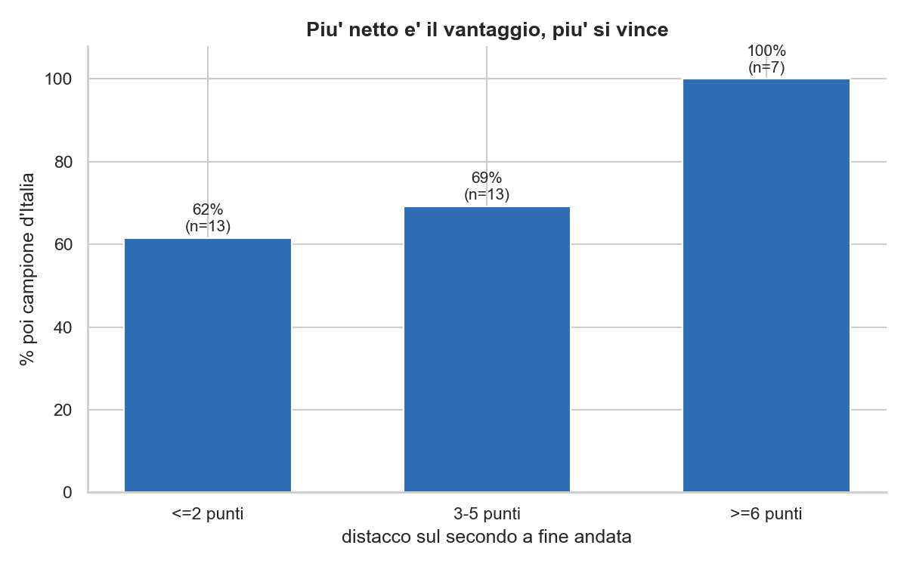
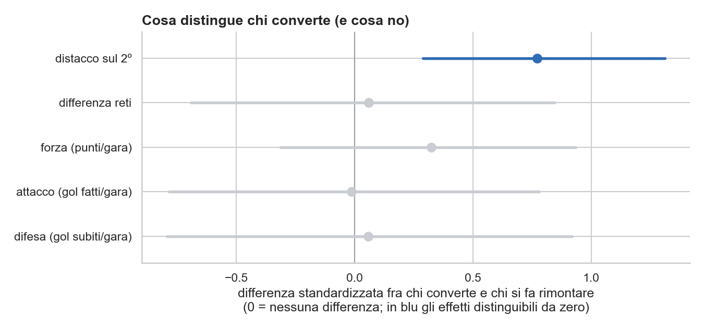

# Si può leggere gennaio?
### Parte 2 — Il modello

*Il campione d'inverno vince il 73% delle volte. Ma cosa distingue chi poi alza la coppa da chi si fa rimontare? Lo abbiamo chiesto a una regressione — con prudenza.*

Nella prima parte avevamo lasciato una domanda aperta. Se non tutti i primati di metà stagione valgono uguale — la Juventus che converte quasi sempre, le rimonte che ogni tanto rovesciano il tavolo — allora dev'esserci qualcosa, già a gennaio, che separa il campione d'inverno destinato al titolo da quello che sfumerà. La forza? Il margine? Proviamo a misurarlo.

## Perché qui non si "prevede"

Prima un avvertimento, che è anche metodo. Le stagioni sono trentatré: pochissime. Con così pochi casi, allenare un modello a *prevedere* e vantarsi dell'accuratezza è un esercizio fragile — il risultato balla a ogni scelta. La domanda giusta, a questi numeri, non è "quanto prevedo bene", ma "c'è un'associazione, quanto è forte, quanto è incerta?". Si legge il modello, non lo si fa giocare d'azzardo. È una differenza di postura, e cambia tutto.

## L'unica cosa che conta

Messa così, la regressione logistica dà una risposta pulita: l'unica variabile che sposta davvero l'ago è il **distacco sul secondo** a metà stagione. Ogni punto di margine in più aumenta di circa la metà le probabilità di chiudere davanti. Non è un effetto enorme — con n=33 nulla lo è in modo netto — ma è il solo segnale che resta in piedi.

E si vede a occhio nudo: chi all'andata ha un margine risicato, due punti o meno, vince poi il 62% delle volte; chi ne ha tre-cinque sale al 69%; e chi chiude con almeno sei punti di vantaggio, in trentatré anni, ha sempre vinto — sette su sette. Un primo assaggio di quella «soglia» su cui torneremo.

## Quello che NON conta (e va detto)

La parte più istruttiva, però, è ciò che *non* funziona. Abbiamo provato la forza assoluta, i punti per partita: niente, i campioni d'inverno sono tutti forti e la forza varia troppo poco per distinguerli. Abbiamo separato l'attacco dalla difesa, gol fatti e gol subiti: segnale praticamente nullo, la "difesa che vince i campionati" qui non si vede. Abbiamo misurato quanto fosse affollata la corsa alle spalle del primo: ma quella, a conti fatti, è solo il distacco visto da un altro lato.

| Cosa abbiamo provato | Aggiunge segnale? |
|---|---|
| Distacco sul secondo | Sì — l'unico (p ≈ 0,07) |
| Differenza reti | Quasi nulla |
| Punti/partita (forza assoluta) | No |
| Attacco e difesa separati | No (≈ zero) |
| Contendibilità (rivali vicini) | È il distacco, visto da un altro lato |

Il messaggio converge: conta *di quanto* sei primo, non *quanto* sei forte né *come* giochi. È un risultato negativo, di quelli che raramente finiscono in un titolo di giornale, e proprio per questo vale la pena scriverlo.

Messa in un grafico, la cosa è netta. Di tutte le caratteristiche del campione d'inverno — forza, attacco, difesa, differenza reti — solo il distacco sul secondo distingue davvero chi poi vince da chi si fa rimontare: la sua barra è l'unica che non tocca lo zero. Tutto il resto è indistinguibile dal caso (e con appena nove rimontati, le bande d'incertezza sono larghe).

Una precisazione, però, prima di seppellire la difesa. Un conto è chiedersi *chi converte* tra i primi d'inverno, un altro *chi diventa campione*. E lì la difesa pesa eccome: in trentatré stagioni il campione d'Italia ha avuto la miglior difesa del torneo nel 73% dei casi, il miglior attacco solo nel 39%. La vecchia idea che «la difesa vince i campionati» nei numeri c'è. Solo che la difesa serve a *costruire* il vantaggio; a spiegare se un vantaggio già costruito regge, no — quello dipende da quanto è grande.

## L'Inter 2025/26, e una previsione onesta

Una prova, per gioco e per onestà. Quest'anno il campione d'inverno è stato l'Inter, con tre punti di margine. Abbiamo addestrato il modello su tutte le altre stagioni — tenendo fuori proprio questa — e gli abbiamo chiesto: che probabilità dai all'Inter? Ha risposto circa il 70%. L'Inter ha poi vinto.

Modello promosso? Calma. Quel 70% è quasi identico al tasso storico: con un margine modesto, il modello non fa che dire "di solito sì". Non ci ha azzeccato per bravura, ma perché la base di partenza è già alta — e un 70% lascia comunque tre possibilità su dieci che andasse storto. Una stagione sola non promuove né boccia nessuno.

## Da una domanda nascono domande

Eravamo partiti da una provocazione tra colleghi, e siamo finiti — giustamente — con più domande di quante ne avessimo all'inizio. Quelle che restano aperte:

- vale solo per la Serie A, o è una legge del calcio? Per scoprirlo servirebbe guardare gli altri campionati, ma senza mescolarli: ognuno è un caso a sé, andrebbero distinti (con variabili di lega o interazioni).
- esiste una **soglia** oltre la quale il titolo è praticamente certo — un margine, o un monte-punti, dopo il quale non si torna indietro?
- il vantaggio dell'inverno è cambiato nel tempo, tra ere di una sola dominatrice ed ere più aperte?
- e se invece di "vince / non vince" guardassimo *di quanto* si vince a fine stagione?
- la difesa fa il campione (73% dei casi) più dell'attacco (39%): è sempre stato così, in tutte le ere? E con dati più ricchi — tiri, possesso, *expected goals* — quali altri tratti di gioco distinguono un campione?
- una domanda diversa, lo stesso spirito: le neopromosse dalla Serie B partono forte e si spengono? Una curva di rendimento per blocchi di giornate direbbe se il «fuoco di paglia» esiste davvero, o è solo un'impressione.

E poi i passi più tecnici, che il piccolo numero di stagioni richiede: stimare la probabilità con un approccio **bayesiano** (una Beta-Binomiale dà la risposta con il suo intervallo di credibilità), intervalli via **bootstrap**, una logistica penalizzata (**Firth**) pensata per i campioni piccoli, un modello **gerarchico** che tratti ogni squadra per quello che è. E, soprattutto, **più dati**: le stagioni storiche pre-1993, che non esistono in un file pronto e andrebbero ricostruite.

C'è anche un modo più onesto di leggere il legame. Il campione d'inverno non vince *perché* è campione d'inverno: lo diventa *perché* ha già mostrato, in mezza stagione, le qualità che servono a vincere — continuità, solidità, una rosa profonda. Il primato di gennaio non è una causa, è una **spia**: non una profezia, ma un buon proxy della forza espressa fin lì. Per questo gli allenatori lo sdrammatizzano — «non conta niente, quello che conta è arrivare a maggio in testa», ha tagliato corto Chivu da campione d'inverno in carica — mentre i numeri, loro, un po' contano. Le due cose non si contraddicono: il titolo non garantisce niente, ma chi se lo prende, di solito, è la squadra giusta.

Resta il punto di partenza, che il modello non scalfisce ma anzi conferma: il campione d'inverno parte nettamente favorito, e ciò che a gennaio fa la differenza è quanto chiaramente è in testa. Trentatré stagioni sono poche per chiamarla legge. È una tendenza forte — e quel 27% di primi traditi dalla primavera è la parte più bella, la prova che il calcio un margine alla rimonta lo lascia sempre.

---

## Nota metodologica

- **Campione d'inverno**: primo quando ogni squadra ha completato l'andata (`min partite ≥ n−1`). Identità verificata contro le fonti per le ultime 10 stagioni (10 su 10); resta una piccola imprecisione sui punti assoluti del primo (rinvii), non sul distacco.
- **Test**: proporzione storica con intervallo di Wilson; contingenza su tutte le coppie squadra-stagione con test esatto di Fisher (preferito al chi-quadro per le frequenze attese basse).
- **Modello**: regressione logistica (statsmodels) letta sui parametri; regressori del campione d'inverno a fine andata. Valutazione Leave-One-Out e prova out-of-sample sull'Inter 2025/26. A n=33 si leggono direzioni e ordini di grandezza, non certezze.

  Dettaglio dei regressori provati:

  | Regressore | pseudo-R² | p-value |
  |---|---|---|
  | distacco sul secondo | 0,14 | 0,07 |
  | + differenza reti | — | 0,71 |
  | punti/partita (forza assoluta) | 0,02 | 0,40 |
  | gol fatti + subiti per partita | 0,00 | ≈ 0,9 |
  | contendibilità (rivali entro 5 punti) | 0,10 | 0,07 (collineare col distacco) |

- Codice, tabelle e test nel [notebook del progetto](../analisi/probScudettoSeCampioneInverno.ipynb); i grafici sono in [`docs/`](../docs/).

---

## Linkografia

**I nostri numeri** — percentuali, regressioni, intervalli e test sono nel [notebook del progetto](../analisi/probScudettoSeCampioneInverno.ipynb); i grafici in [`docs/`](../docs/). La rassegna completa delle fonti è in [`resources/`](../resources/).

**Le fonti citate** (pubbliche, divulgative e giornalistiche, non peer-reviewed — numeri indicativi):

- [Lega Serie A](https://www.legaseriea.it/serie-a/news/inter-col-lecce-per-diventare-campione-d-inverno) — il campione d'inverno nella storia (63 su 93, 67,7%).
- [Sky Sport](https://sport.sky.it/calcio/serie-a/serie-a-campioni-inverno-scudetto-precedenti) — campioni d'inverno e scudetto, i precedenti.
- [Calcio e Finanza](https://www.calcioefinanza.it/2026/01/05/serie-a-campione-dinverno-2026-chi-e/) — cos'è il campione d'inverno (un titolo «puramente giornalistico»).
- [PokerStars News](https://www.pokerstarsnews.it/calcio/campione-inverno-cosa-significa-statistiche/37019/) — cosa significa e le statistiche (a metà stagione «i valori sono già delineati»).
- [SportMediaset](https://www.sportmediaset.mediaset.it/calcio/inter/inter-campione-inverno-statistica-scudetto_107743377-202602k.shtml) — la statistica scudetto nell'era recente (~79%).
- [Sportal](https://www.sportal.it/calcio/serie-a/inter-lecce-cristian-chivu-il-titolo-d-inverno-non-conta-eusebio-di-francesco-si-tiene-la-prestazione.html) — Chivu: «il titolo d'inverno non conta».
- [FCInter1908](https://www.fcinter1908.it/news/interviste/immobile-intervista-scudetto-inter-inzaghi/) — Immobile sul peso del doppio impegno e delle tante partite.
